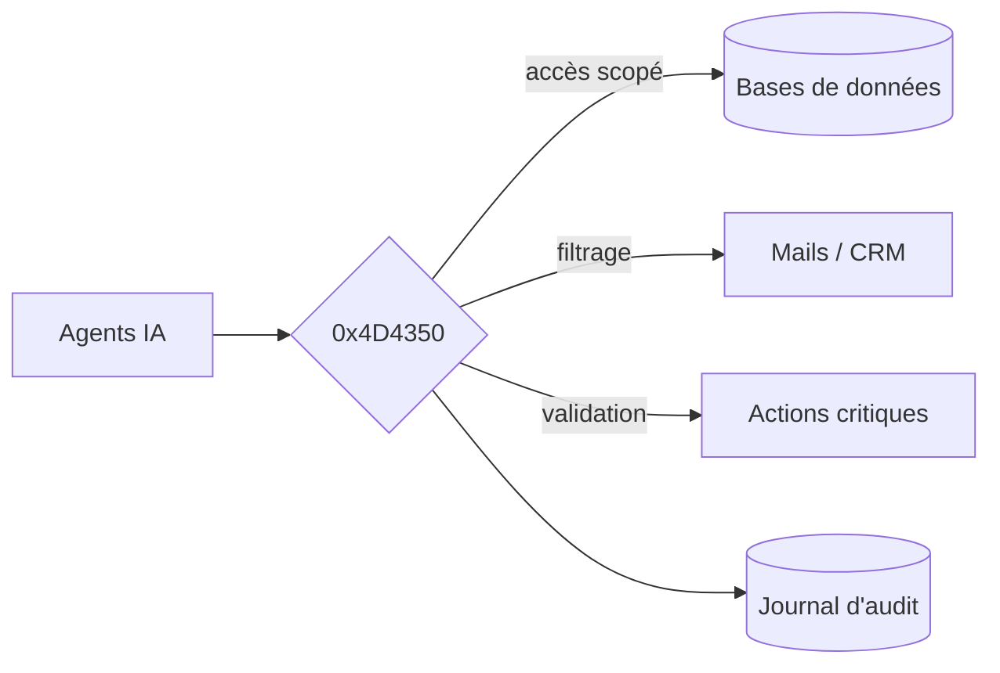

# 0x4D4350

### Vos agents IA. Vos données. Sous contrôle.

Une seule porte entre l'intelligence artificielle et vos systèmes.
Rien ne passe sans permission.

---

## Le problème tient en une phrase.

On confie les clés de la maison à l'IA. Sans poser de serrure.

Bases de données. Mails. CRM. Fichiers. Un agent y accède aujourd'hui en direct — trop de droits, aucune trace, aucun garde-fou. Une seule instruction piégée suffit à tout faire fuir.

## La gateway qui dit non.

0x4D4350 s'installe entre vos agents et vos systèmes. Tout passe par elle. Elle décide. Elle filtre. Elle se souvient.

**Moindre privilège.**
Chaque agent obtient l'accès strictement nécessaire. Rien de plus.

**Anti-fuite.**
Les données sensibles sont filtrées avant de quitter vos murs.

**Validation humaine.**
Les actions critiques attendent votre feu vert.

**Audit total.**
Chaque appel est tracé. Rien n'échappe au journal.

## Comment ça marche.

Une seule voie. Toujours surveillée.

## Pensé pour ceux qui protègent.

Les équipes sécurité et infra qui déploient l'IA — sans jamais exposer leurs données.

---

**0x4D4350**

« MCP » en hexadécimal. Le protocole que nous sécurisons.

*En cours de conception.*

