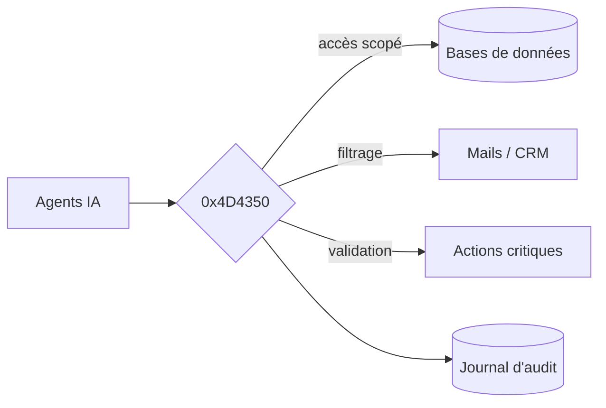

<div align="center">

# `0x4D4350`

### Le pare-feu entre vos agents IA et vos données.

`4D 43 50` → `M C P` · *le protocole qu'on verrouille.*


</div>

---

> ### On a donné à l'IA les clés de la maison. On a oublié de poser une serrure.

Vos agents accèdent en direct à vos bases, vos mails, votre CRM. Trop de droits, aucune trace, aucun garde-fou. **Une seule instruction piégée suffit à tout faire fuir.**

`0x4D4350` se place entre les agents et vos systèmes. Tout passe par lui. Il décide. Il filtre. Il se souvient.

## Avant / après

| Sans `0x4D4350` | Avec `0x4D4350` |
| :--- | :--- |
| Accès total, par défaut | **Moindre privilège**, par défaut |
| Les données fuient en silence | **Filtrées** avant de sortir |
| Actions critiques sans contrôle | **Validation humaine** obligatoire |
| Aucune trace en cas d'incident | **Tout** est journalisé |

## La politique tient en un fichier

```yaml
# policy.0x4D4350.yaml
agent: support-bot
allow:
  - crm.read
deny:
  - "*.delete"
require_human:     # feu vert humain obligatoire
  - payments.*
redact:            # filtré avant de quitter vos murs
  - pii
audit: full
```

Lisible. Versionnable. Auditable. Pas de magie noire.

## Sous le capot



Une seule voie. Toujours surveillée.

## Pour qui

Les équipes **sécurité** et **infra** qui déploient l'IA — sans jamais exposer leurs données.

---

<div align="center">

**`0x4D4350`** · « MCP » en hexadécimal · *en cours de conception*

</div>